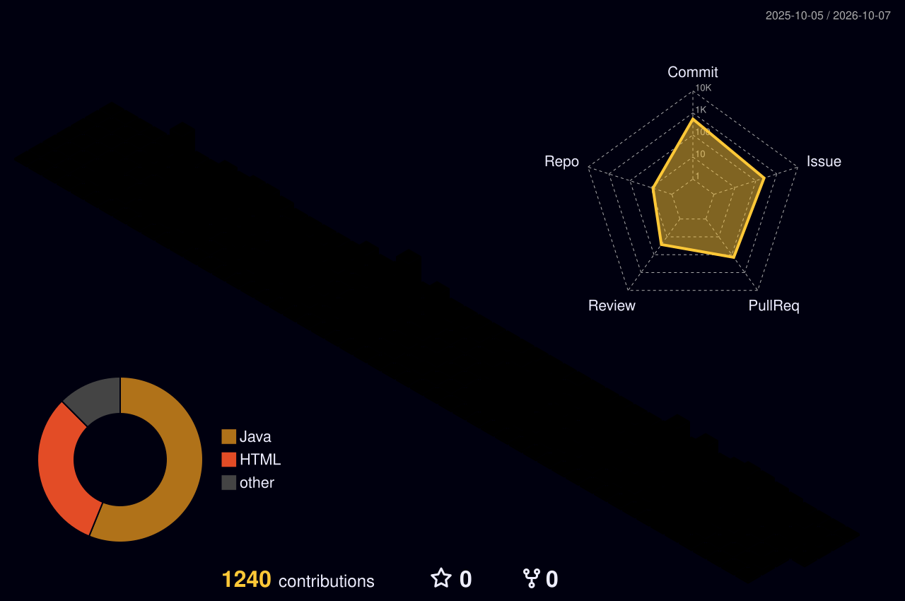

# 👋 안녕하세요, 백엔드 개발자 고나영입니다.

### 문제의 원인을 파고들고, 변화에 강한 코드를 설계합니다.

사용자의 요청이 **어떤 흐름으로 처리되고 데이터가 어떻게 변화하는지** 이해하는 것을 중요하게 생각합니다.  
단순히 동작하는 기능을 만드는 데 그치지 않고  
**데이터 정합성 · 예외 상황 · 유지보수성**을 함께 고려하며 개발합니다.

---

## 👩‍💻 About Me

- Java와 Spring Boot를 중심으로 백엔드 서비스를 개발하고 있습니다.
- 문제가 발생하면 보이는 오류만 수정하기보다 **요청부터 데이터 저장까지의 흐름을 추적**합니다.
- 새로운 기술을 사용할 때는 사용법뿐 아니라 **왜 필요한지, 어떻게 동작하는지** 이해하려고 합니다.
- 기능 추가 시 기존 API와 데이터 구조에 미치는 영향을 고려하며 **변경에 강한 구조**를 고민합니다.
- 코드 리뷰를 통해 다른 사람의 구현을 이해하고, 더 나은 설계 방향을 함께 고민하는 것을 좋아합니다.
---

## 🛠 Tech Stack

---

## 🚀 Projects

> 프로젝트 기술은 **제가 직접 구현 과정에서 사용한 기술**을 기준으로 작성했습니다.

### 💊 iUnoT
**AI Agent와 함께하는 의약품 재고 관리 서비스**

`Spring Boot · Spring AI · MySQL · Thymeleaf`

- 조직 · 부서 · 사용자 관리와 초대 흐름을 설계하고 구현했습니다.
- 자연어 요청에 따라 재고 조회 Tool을 선택하고 실행하는 **AI Agent 흐름**을 구현했습니다.
- 사용자 권한에 따라 접근 가능한 저장소만 조회하도록 데이터 범위를 제한했습니다.
- 프로젝트 초기에 Git Convention을 정리하고, 3개 핵심 저장소 PR 댓글 201건 중 **104건(51.7%)**을 작성했습니다.

🔗 [iUnoT Organization](https://github.com/nhnacademy-aiot3-iUnoT)

---

### 📚 4VIDIA
**AI 검색 기능을 제공하는 온라인 도서 쇼핑몰**

`Spring Boot · Redis · MySQL`

- 장바구니와 포인트 도메인을 설계하고 REST API를 구현했습니다.
- Redis의 빠른 조회와 MySQL의 영속성을 함께 활용하는 **장바구니 동기화 구조**를 설계했습니다.
- TTL과 만료 이벤트를 활용해 장바구니 데이터를 관리하고, 불필요한 DB 동기화 작업을 줄였습니다.
- 포인트 적립 · 사용 · 환불 · 만료의 생명주기를 정책에 따라 구현했습니다.

🏆 NHN Academy 성과발표회 **우수상**

🔗 [4VIDIA Organization](https://github.com/nhnacademy-be12-4vidia)

---

## 💡 What I Care About

### Data Flow
문제가 발생했을 때 오류가 보이는 부분만 수정하지 않고  
**요청 → 비즈니스 로직 → 데이터 저장 → 응답** 흐름을 따라가며 원인을 찾습니다.

### Maintainability
기능 구현뿐 아니라  
**기존 구조에 미치는 영향 · 데이터 정합성 · 예외 상황 · 변경 가능성**을 함께 고려합니다.

### Why, not only How
새로운 기술을 사용할 때 단순히 사용법을 익히기보다  
**왜 필요한지, 어떤 문제를 해결하는지** 이해한 뒤 적용하려고 합니다.

---

## 🎓 Education

**NHN Academy IoT 웹서비스 개발 과정**  
`2025.12 ~ 2026.09`

**NHN SW Academy Java Backend 12기**  
`2025.07 ~ 2025.12`

---

## 📜 Certifications

- 정보처리기사
- SQL 개발자 (SQLD)
- TOPCIT Level 3 · 535점

---

### 문제의 원인을 파고들고, 변화에 강한 코드를 설계하는 개발자가 되겠습니다.

📫 **loejdhs@gmail.com**

